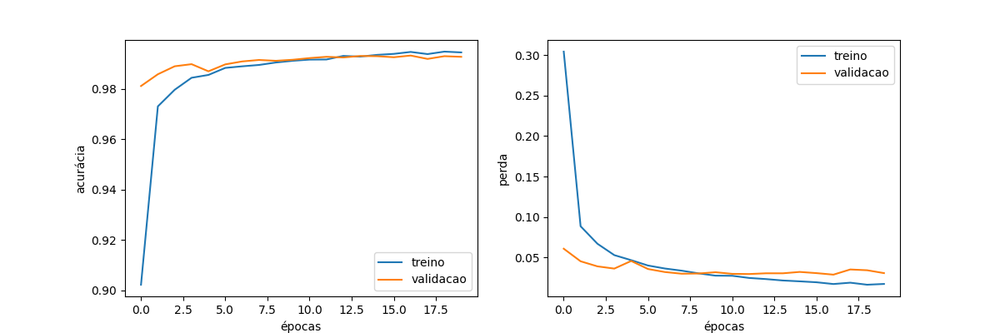

# Aplicação web para detecção de algarismos

Esse repositório contém uma aplicação web que permite que o usuário faça upload de imagens para serem analisadas por modelos de redes neurais, a fim de detectar algarismos numéricos contidos nelas. O usuário pode optar por uma análise feita por uma Rede Neural Convolucional ou por uma Rede Neural Linear.

## Documentação das rotas

A aplicação é baseada em Flask, contando com um backend que possui duas rotas para análise de imagens submetidas pelo usuário.

### `/input_cnn` - Detecção de Algarismo com Rede Neural Convolucional

#### Métodos Aceitos: GET, POST

#### Descrição:
Esta rota permite ao usuário enviar uma imagem contendo um número manuscrito para ser analisada por uma rede neural convolucional (CNN) treinada. A rota processa a imagem, faz a predição e retorna o resultado.

#### Funcionamento:

**GET Request:**
- Exibe a página input_cnn.html com um formulário para o envio de uma imagem.

**POST Request:**
- Verifica se um arquivo foi enviado e se não está vazio.
- Salva o arquivo no diretório temporário ./temp.
- Carrega o modelo pesos.h5.
- Carrega a imagem salva, converte para escala de cinza, redimensiona para 28x28 pixels, normaliza e aplica um limiar binário.
- Realiza a predição utilizando o modelo carregado.
- Renderiza a página input_cnn.html mostrando a predição do número detectado.

### `/input_lnn` - Detecção de Algarismo com Rede Neural Linear

#### Métodos Aceitos: GET, POST

#### Descrição:
Esta rota permite ao usuário enviar uma imagem contendo um número manuscrito para ser analisada por uma rede neural linear (NN) treinada. A rota processa a imagem, faz a predição e retorna o resultado.

#### Funcionamento:

**GET Request:**
- Exibe a página input_cnn.html com um formulário para o envio de uma imagem.

**POST Request:**
- Verifica se um arquivo foi enviado e se não está vazio.
- Salva o arquivo no diretório temporário ./temp.
- Carrega o modelo pesos.h5.
- Carrega a imagem salva, converte para escala de cinza, redimensiona para 28x28 pixels, normaliza e aplica um limiar binário.
- Realiza a predição utilizando o modelo carregado.
- Renderiza a página input_cnn.html mostrando a predição do número detectado.

## Demonstrações

### Aplicação web

Para conferir um vídeo de demonstração da aplicação web, [clique aqui](google.com). Nesse vídeo o usuário abre uma janela de terminal e executa a aplicação web de acordo com o **passo 3** da seção de instalação e execução. Depois de acessar o endpoint `/input_cnn`, ele envia uma imagem com o algarismo **3** para análise da Rede Neural Convolucional e obtém o número detectado por ela na parte inferior da página. O usuário repete o processo após clicar no botão de troca para a Rede Neural Linear, analisando a mesma imagem e obtendo o mesmo resultado.

### Treinamento dos modelos

Os resultados obtidos a partir do treinamento dos modelos envolvidos no projeto podem ser melhor compreendidos a partir das figuras a seguir. Cada figura apresenta dois gráficos, um referente à métrica de acurácia (accuracy) do modelo ao longo de cada época de treinamento e outro referente à métrica de perda (loss) do modelo ao longo de cada época de treinamento.

<p style="text-align: center;">Figura 1 - Resultados do treinamento da Rede Neural Convolucional</p>



<p style="text-align: center;">Fonte: Elaboração própria</p>

<p style="text-align: center;">Figura 2 - Resultados do treinamento da Rede Neural Linear</p>


<p style="text-align: center;">Fonte: Elaboração própria</p>

Com base na análise desses gráficos, percebe-se que o modelo convolucional obtém uma acurácia maior num menor número de épocas em comparação com o modelo linear. Contudo, o tempo de treinamento é maior para o modelo convolucional, uma vez que ele é mais complexo e exige mais processamento do computador do que o modelo linear.

## Instalação e execução

### Pré-requisitos

- Git instalado
- Python 3 e pip instalados

### Passo a passo

#### Instalação

1. Abra uma janela de terminal no diretório de sua preferência, clone o repositório e adentre o diretório recém criado através dos seguintes comandos:

```bash
git https://github.com/RaiDeOliveira/mnist-cnn-webapp.git
cd mnist-cnn-webapp
```

2. Na mesma janela de terminal, digite os seguintes comandos para instalar as dependências necessárias para rodar o projeto:

> :bulb: **Dica:** Se você preferir, crie e ative um ambiente virtual em Python através sos seguintes comandos antes dessa etapa:
> `python3 -m venv venv`
> `source venv/bin/activate` (comando específico para SO Linux)

```bash
pip install flask tensorflow keras matplotlib numpy np_utils opencv-python
```

#### Executar aplicação web

3. Para executar a aplicação web, digite o seguinte comando na mesma janela de terminal:

```bash
cd web-app
flask --app app run
```

#### Treinar modelo CNN

4. Para treinar o modelo de Rede Neural Convolucional, digite o seguinte comando a partir da raiz do diretório com o conteúdo do repositório:

```bash
python3 cnn.py
```

#### Treinar modelo LNN

5. Para treinar o modelo de Rede Neural Linear, digite o seguinte comando a partir da raiz do diretório com o conteúdo do repositório:

```bash
python3 lnn.py
```
